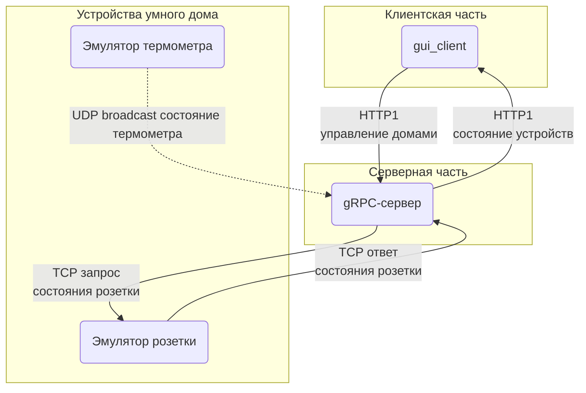

# SmartHome

1. [Задание 1](exercise_1.md)
1. [Задание 2](exercise_2.md)
1. [Задание 3](exercise_3.md)
1. [Задание 4](exercise_4.md)
1. [Задание 5](exercise_5.md)
1. [Задание 6](exercise_6.md)

SmartHome - библиотека, которая позволяет моделировать умный дом.

## Веб-сервис

`grpc_api` - grpc-сервис, предоставляющий доступ к функциям управления умными домами.  
`gui_client` - пользовательский интерфейс для управления умными домами.  
`proto` - контракты для вызова удаленных процедур и получения ответов.

### `gui_client`

Написан с использованием slint - инструментарий для создания нативных десктопных и встраиваемых приложений на Rust, C++ или JavaScript.
Результат - HTML-страничка с canvas и wasm приложение для отрисовки элементов gui и получения данных с удаленного `grpc_api`.

### `grpc_api`

Написан с использованием tonic + prost.

Принимает и отдает сообщения в соответствии с контрактами в `proto`.

Использует библиотеку sh_lib для управления умными домами.

При запуске стартует `sh_socket_emulator` на 3001 порту и два экземпляра `sh_therm_emulator` на 4001 и 4002 портах (`sh_socket_emulator` и `sh_therm_emulator` из [Задание 3](exercise_3.md)).
Эмуляторы поставляют данные в устройства, которые могут быть добавлены через gui_client.

> Так как wasm не поддерживает HTTP2, то grpc_api также реализует взаимодействие по HTTP1.

### Тесты

Интеграционные тесты выделены пв отдельное крейт `tests_grpc_api`.

Для их выполнения нужно чтобы grpc-сервер (grpc_api) был доступен по адресу 127.0.0.1:50051.

Выполнить тесты: `cargo test`.
